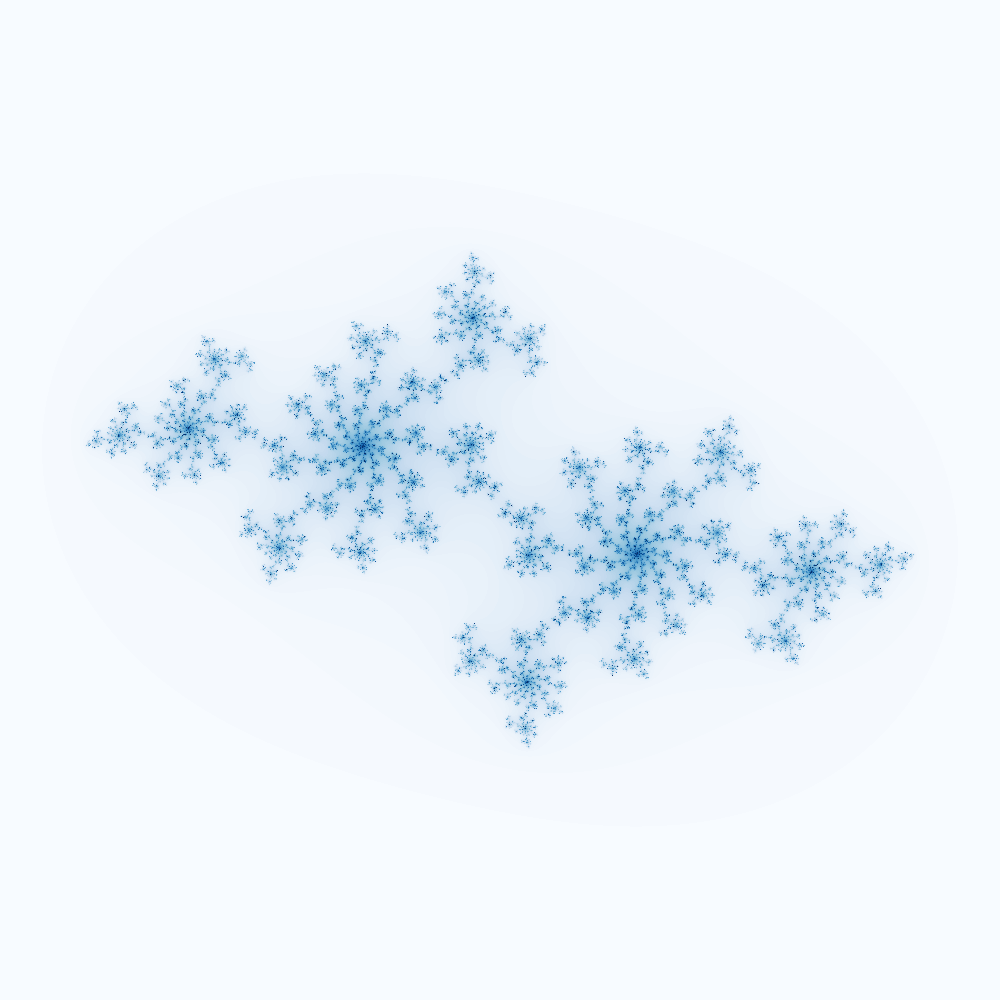

# visualizations

trying to make pretty graphs. im still learning

```python
from julia_set import JuliaSet

# Define a function to be used (Only numpy operations supported)
def func(z, c:complex):
    return z * z + c

J = JuliaSet(f= func, c = (-0.70176 -0.3842j),height= 1000, width=1000, max_iters=100)
J.show_julia_set(cmap="Blues") # displays the set in the console
J.save_julia_set(fname="julia-set-1.png", cmap = "Blues") # saves the image in the current directory

# Resulting output image
```



### todo:

- implement lyapunov fractals
- faster implementation of currently existing
- MUCH BETTER VISUALIZATIONS ofc
